# StreamingApp — Orchestration and Scaling

This is my submission for the graded project. StreamingApp is a MERN app (a React
frontend and four Node/Express services — auth, streaming, admin, chat — backed by
MongoDB). I containerized every component, pushed images to ECR through Jenkins,
deployed the whole thing to EKS with Helm, and wired up CloudWatch monitoring/logging
plus a Slack/Teams-style deployment notification through SNS as a bonus.

Repo: `github.com/tanishq-123/StreamingApp` (forked from `UnpredictablePrashant/StreamingApp`)

AWS account/region: `277385995709`, `us-east-1`

## Architecture

```
                    Internet
                       |
              ALB (nginx ingress controller)
                       |
        ---------------------------------------
        |        |         |         |        |
    frontend   /api/auth /api/streaming /api/admin /api/chat
    (React,      auth     streaming     admin      chat
     nginx)      :3001     :3002        :3003      :3004
        |          |          |            |          |
        -----------+----------+------------+----------
                               |
                          MongoDB (StatefulSet + PVC)
```

Everything runs in one EKS cluster (`streamingapp-cluster`), one namespace (`default`
for the app, plus `ingress-nginx` and `amazon-cloudwatch` for the supporting
infrastructure). Each backend service and the frontend are separate Deployments with
their own ClusterIP Service, all sitting behind a single nginx Ingress that path-routes
to the right backend.

## Step 2 — Containers and ECR

All five Dockerfiles (frontend + the four backend services) already existed in the repo,
I didn't need to write new ones. Frontend is a multi-stage build (`node:18-alpine` for
the build, `nginx:1.27-alpine` to serve the static output). The three backend services
other than auth build with `./backend` as the Docker context because their Dockerfiles
`COPY` paths assume that — auth builds from its own folder directly.

Created one ECR repo per component:

```
streamingapp/frontend
streamingapp/auth
streamingapp/streaming
streamingapp/admin
streamingapp/chat
```

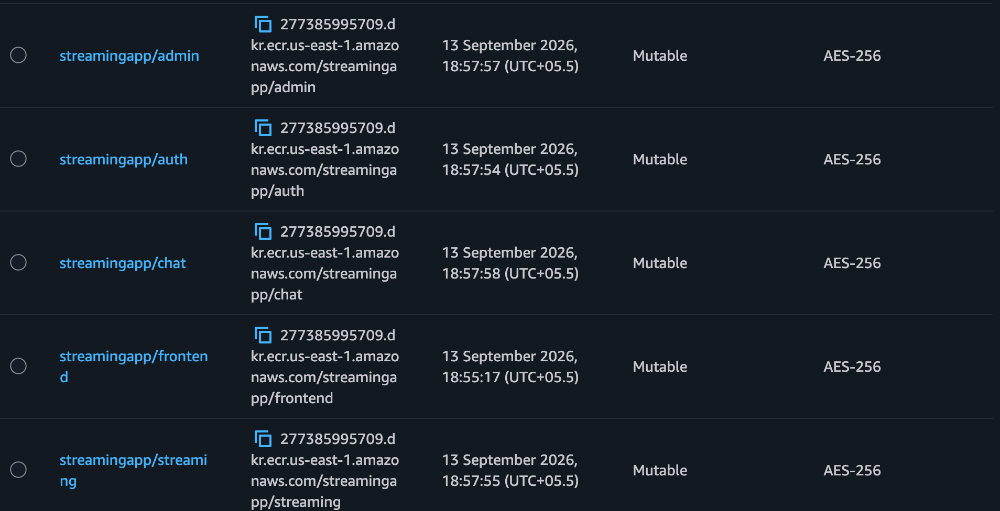

Built and pushed all five manually first, to confirm everything worked before automating
it in Jenkins:

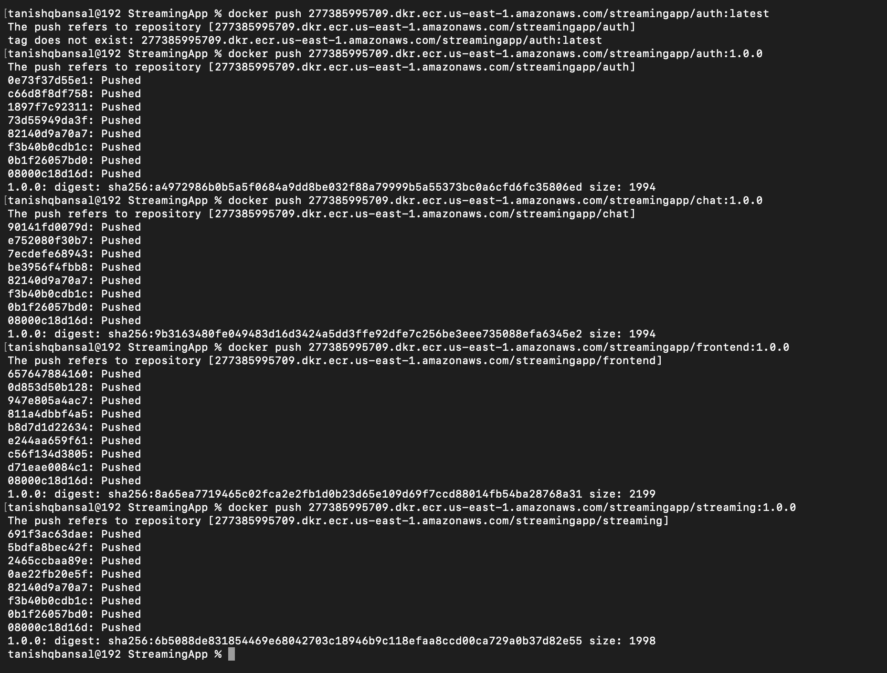

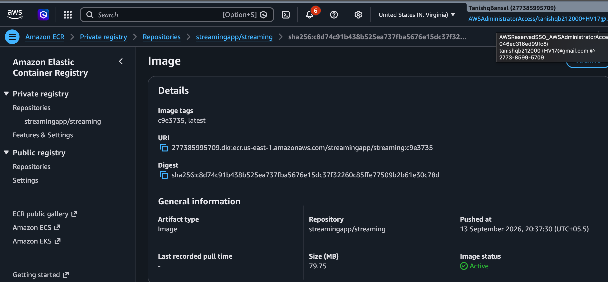

**Something I got wrong the first time:** `--platform linux/amd64` matters if you're
building on an Apple Silicon Mac — without it, the image comes out arm64 and just fails
to start on EKS's x86_64 nodes with `exec format error`.

## Step 3 — AWS CLI

Straightforward — `aws configure`, then confirmed with `sts get-caller-identity`.

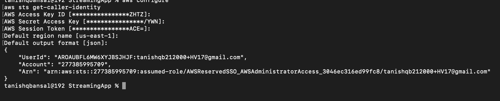

## Step 4 — Jenkins CI

I used the shared academic Jenkins instance rather than standing up my own EC2 box,
since that's what was provided for this project. Checked first that the shared agent
actually had Docker, kubectl, aws-cli and helm available before writing anything —
it did.

One Jenkinsfile per component, all doing the same thing: checkout, install/build inside
a throwaway `node:18-alpine` container, build the Docker image, push to that component's
ECR repo, then a notification step. I named everything `streamingapp-tanishq-*` (jobs,
credentials) since this Jenkins instance is shared with other students and generic names
would've been asking for a collision.

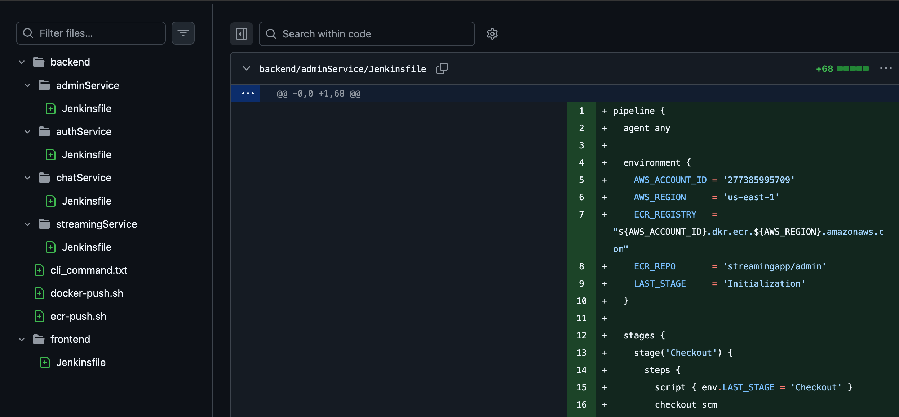

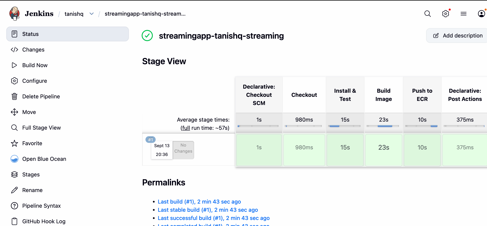

GitHub webhook triggers all five jobs on push:

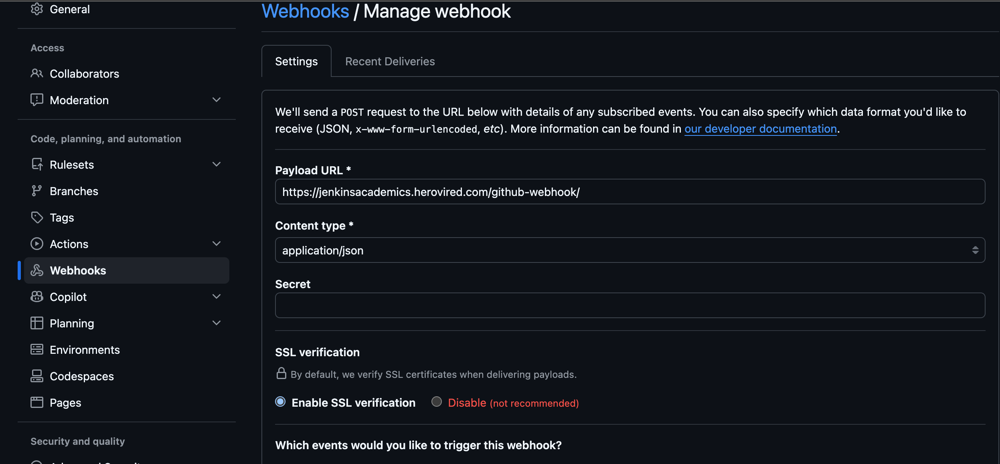

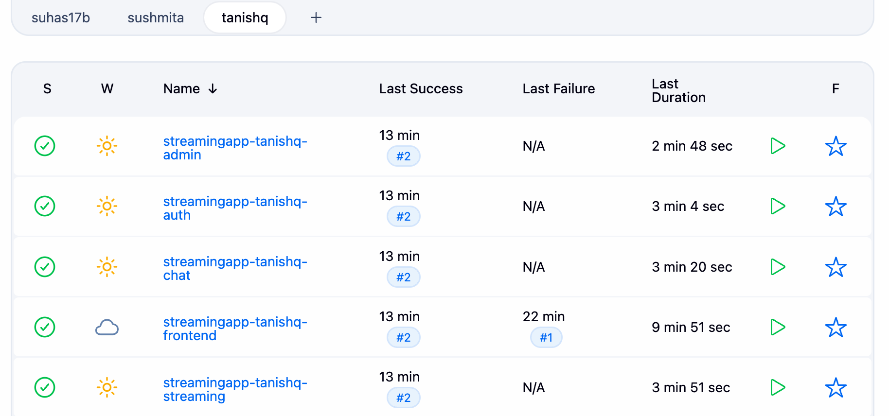

(the frontend job shows one earlier failure in that screenshot — see the issues section
below, that one took a bit to track down)

## Step 5 — EKS and Helm

Cluster:

```
eksctl create cluster --name streamingapp-cluster --region us-east-1 \
  --nodegroup-name streamingapp-nodes --node-type t3.medium \
  --nodes 2 --nodes-min 2 --nodes-max 4 --managed
```

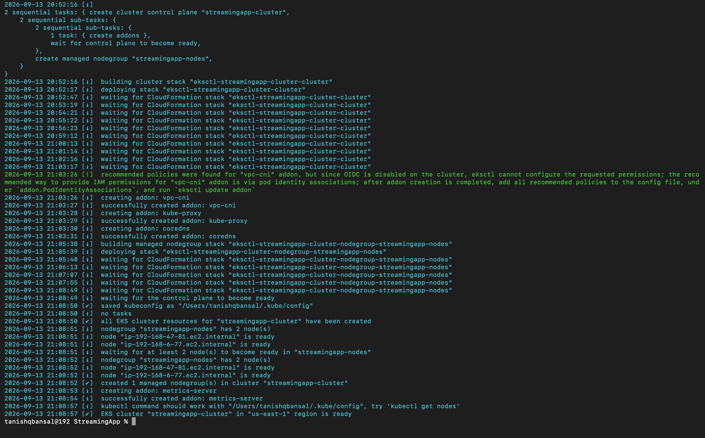

Ended up scaling this to 4 nodes partway through, more on that below.

Packaged the app as a Helm chart — one templated file looping over the four backend
services (so `values.yaml` drives image tags, replica counts, ports and health paths
instead of four nearly-identical copy-pasted manifests), a separate template for
frontend, a StatefulSet + PVC for Mongo, a Secret for JWT/AWS credentials, and an
Ingress routing all five paths. HPA is on for every Deployment (2-4 replicas, 70% CPU
target).

Installed `ingress-nginx` via Helm first, then `helm install streamingapp ./helm`.

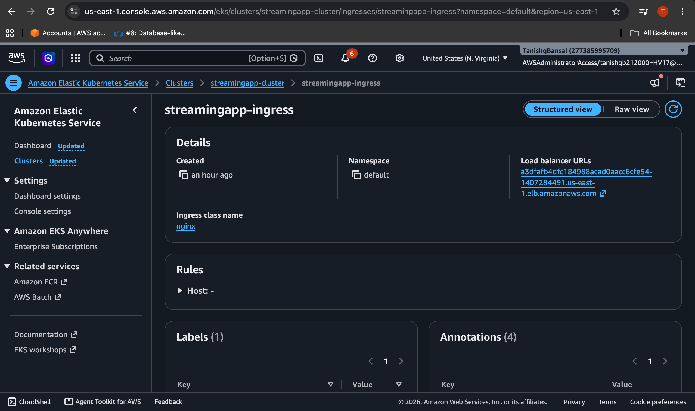

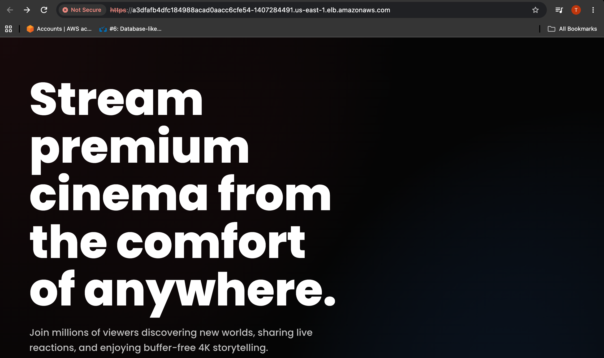

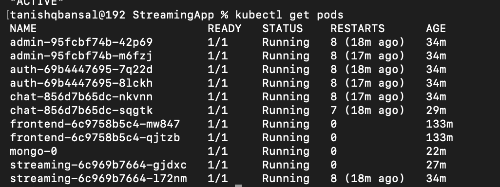

## Step 6 — CloudWatch

Installed the `amazon-cloudwatch-observability` EKS add-on, which handles both metrics
and log shipping in one piece (CloudWatch agent + Fluent Bit as DaemonSets):

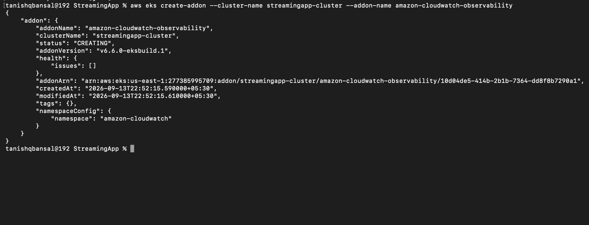

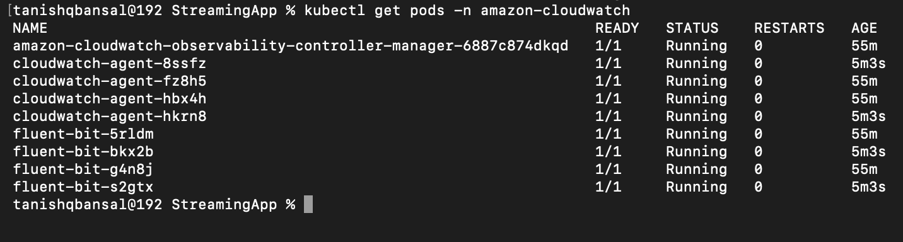

Log groups populated per data type:

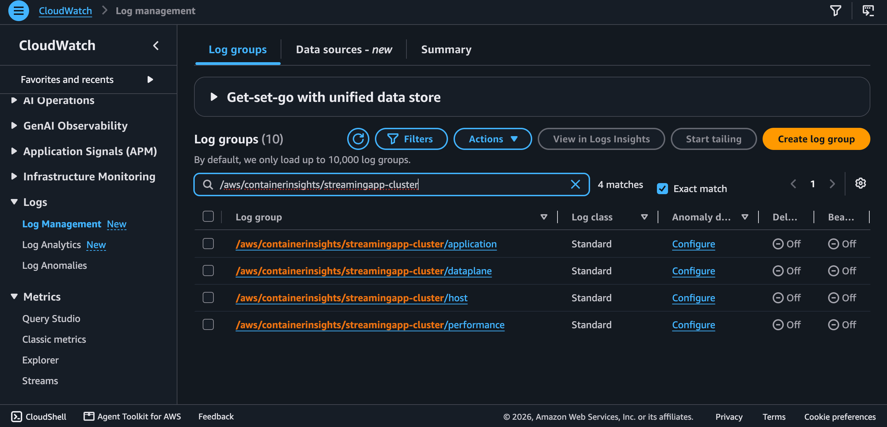

Sample log entry from one of the admin service pods, showing the request/response
logging and the full Kubernetes metadata CloudWatch attaches automatically:

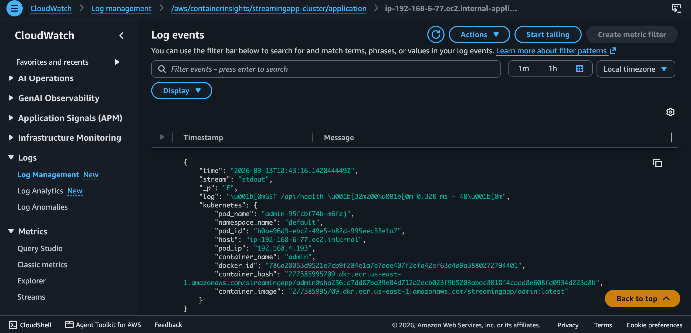

Set up an alarm on the number of running pods in the namespace as one of my three
alarms (the other two watch pod CPU and node memory):

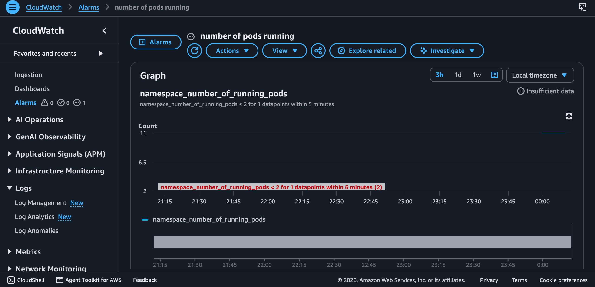

## Step 7 — Documentation

This file, plus the architecture sketch above and the Helm chart itself, all pushed to
the repo.

## Step 8 — Final validation

Frontend and all four backends are reachable through the single Ingress address and
respond correctly (login, browse, upload, chat all tested manually against the live
deployment, not just docker-compose locally). Scaling tested by bumping replica counts
and watching the deployment stay healthy throughout — pods that crashed during the
Mongo issue below also recovered on their own once the underlying problem was fixed,
which is a decent proof that the self-healing behaviour actually works.

## Step 9 (bonus) — Deployment notifications

Added a sixth Jenkins job that runs `helm upgrade --install` against the cluster after
the five build jobs succeed, then publishes to one of two SNS topics depending on
whether the deploy succeeded or failed.

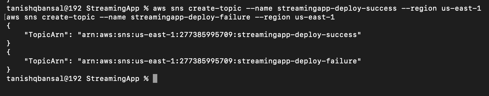

The CD job needed its own AWS access to talk to EKS (separate from the ECR-only
permissions the build jobs use), so I created an access entry for the Jenkins IAM user
and associated the EKS admin access policy with it:

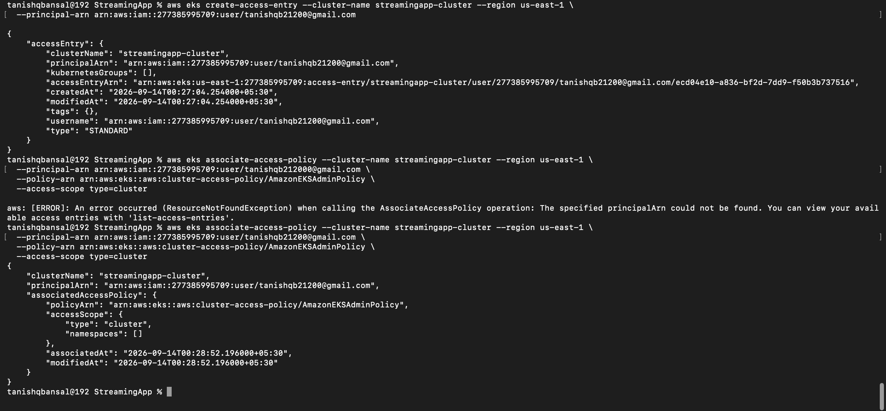

For the actual notification, SNS fans out to a small Lambda which posts a formatted
message into a Microsoft Teams channel (via the Teams Workflows app — the older
Incoming Webhook connector Microsoft used to support for this has been retired).

The deploy job didn't go green on the first few attempts — builds #20 through #24 all
failed at the Helm upgrade stage, and each one correctly triggered a failure
notification, which ended up being a decent side effect: it proved the failure branch
of the notification path actually works, not just the success path. Build #26 finally
succeeded.

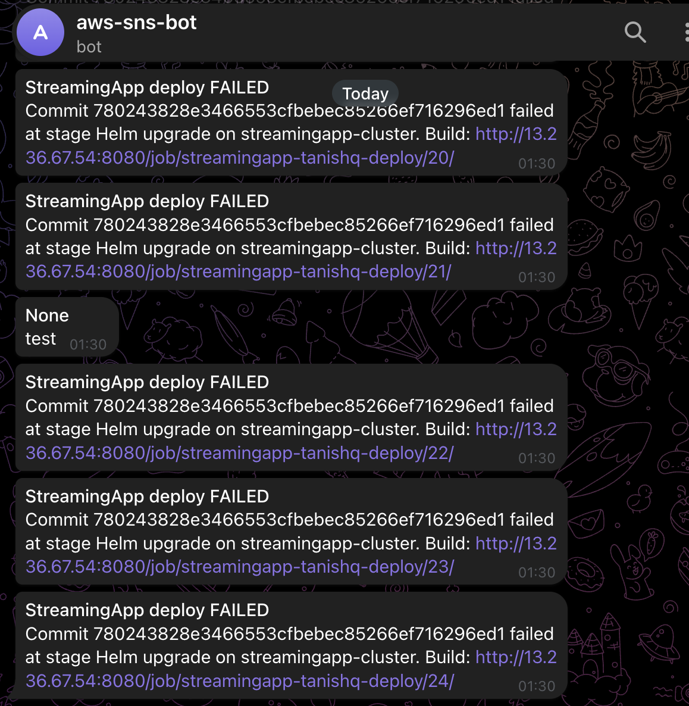

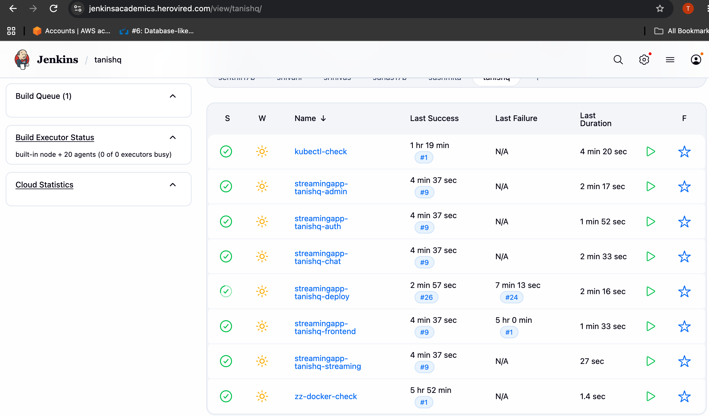

## Issues I ran into

I'm including these because a few of them ate real time and I think they're worth
recording, not just the happy path.

**Docker build args with `<angle brackets>` broke a shell step.** I'd left a placeholder
like `http://<your-ingress-host>` in the frontend Jenkinsfile before I had a real Ingress
address. `<` and `>` are shell redirection operators, so the pipeline tried to read input
from a file called `your-ingress-host` and failed with a confusing "no such file" error
that had nothing obviously to do with the real problem. Lesson: never put angle-bracket
placeholders directly into a `sh` block.

**`env.LAST_STAGE` didn't update the way I expected.** I set up a pattern where each
stage sets `env.LAST_STAGE` so failure emails/logs say which stage actually failed. If
you declare that variable in the top-level `environment {}` block and then reassign it
inside a `script {}` step further down, the reassignment doesn't reliably propagate back
out to the `post {}` block in a declarative pipeline — it kept reporting "Initialization"
even when the real failure was several stages later. Fixed by not pre-declaring it in
`environment {}` at all and just setting it fresh in each stage.

**Mongo pod stuck `Pending` forever, and every backend crash-looping because of it.**
This was the big one. Root cause: I'd never installed the `aws-ebs-csi-driver` add-on,
so there was nothing to actually provision an EBS volume for the Mongo StatefulSet's
PVC.

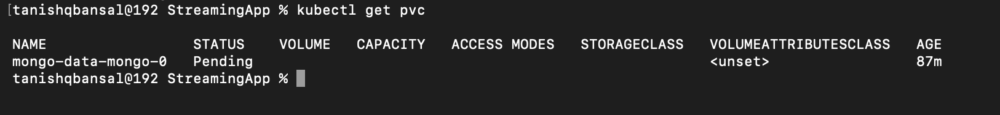

Fixed by attaching the `AmazonEBSCSIDriverPolicy` to the node group's IAM role and
installing the add-on. This cluster has OIDC disabled, so IRSA (the normal way to give a
specific add-on its own scoped permissions) wasn't available — permissions had to go on
the node role directly instead, which is broader than I'd ideally want but was the only
option given the setup.

**Then Mongo was still `Pending` after the volume issue was fixed** — this time with a
`FailedScheduling: Too many pods` error. While the backends were crash-looping waiting
on Mongo, the HPA I'd configured (up to 6 replicas per service) had scaled everything up
in response to the CPU churn from constant restarts, and that ate up all the available
pod slots on my two `t3.medium` nodes (each node has a hard cap on pods based on how
many IPs its ENIs can hand out, not just CPU/memory). Scaled the node group to 4 nodes
to unblock it immediately, and lowered the HPA max to 4 so this doesn't happen again.

**CloudWatch agent pods were `Running` but nothing was showing up in Logs.** Same shape
of problem as the EBS driver — the add-on was up, but the agent's calls to
`logs:PutLogEvents` were failing with `AccessDeniedException`, because (again, no OIDC)
there was no IAM permission attached anywhere for it. Attached
`CloudWatchAgentServerPolicy` to the same node role and restarted the DaemonSets.

**CD pipeline: `helm upgrade` worked but `kubectl rollout status` immediately after it
failed with `Unauthorized`.** EKS authentication through kubectl isn't a static token —
the kubeconfig `aws eks update-kubeconfig` writes calls out to `aws eks get-token` fresh
on every single `kubectl` invocation, using whatever AWS credentials happen to be in the
shell environment at that exact moment. My "Verify rollout" stage wasn't wrapped in the
same credentials block as the earlier stages, so it had no AWS credentials and the token
request failed silently from `kubectl`'s point of view. Wrapped that stage the same way
as the others and it started working.

## What I'd change for a real production setup

Namespaces per environment instead of dumping everything in `default`, TLS on the
Ingress instead of plain HTTP, and enabling OIDC on the cluster so permissions could go
through IRSA scoped to individual service accounts instead of attaching fairly broad
policies to the shared node role — that's the thing I'd fix first if I were running this
for real, since right now any pod on those nodes technically has the same AWS
permissions as the EBS driver and CloudWatch agent.
